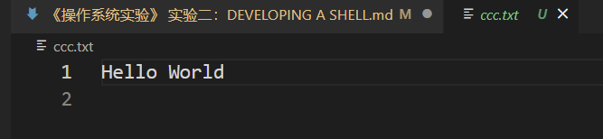
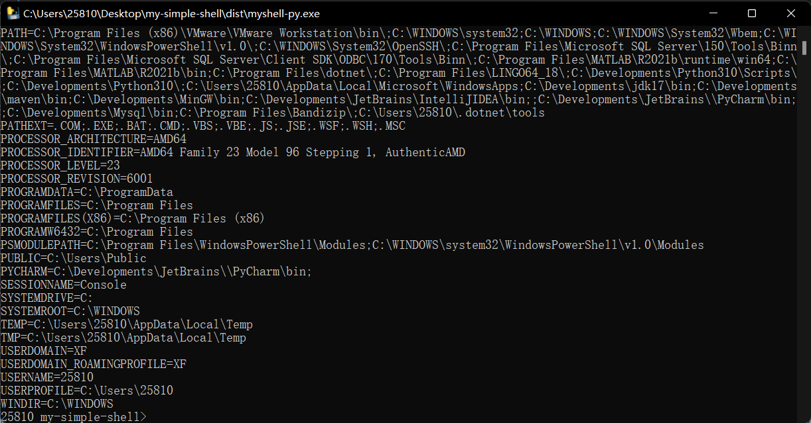

# 《操作系统实验》实验二：DEVELOPING A SHELL

## 一、实验目的
1. 编写Linux命令解释程序shell；
2. 熟悉Linux shell有关系统调用；


## 二、要求
1. 必须自己独立完成，若发现抄袭（从网上或其他同学）或雷同则取消本课程考试资格！
   1. Design a simple command line shell that satisfies the above criteria and implement it on the specified UNIX platform.（设计一个简单的命令行shell，满足上述条件，并在指定的UNIX平台上实现它。）
   2. Write a simple manual describing how to use the shell. The manual should contain enough detail for a beginner to UNIX to use it. For example, you should explain the concepts of I/O redirection, the program environment, and background program execution.（编写一个简单的手册，描述如何使用shell。该手册应该包含足够的详细信息，以供UNIX初学者使用。例如，您应该解释I/O重定向、程序环境和后台程序执行的概念。）
   3. The source code MUST be extensively commented and appropriately structured to allow your peers to understand and easily maintain the code. Properly commented and laid out code is much easier to interpret, and it is in your interests to ensure that the person marking your project is able to understand your coding without having to perform mental gymnastics!（源代码必须有大量的注释和适当的结构，以便您的同行能够理解和容易地维护代码。正确注释和布局的代码更容易解释，确保为项目做标记的人能够理解您的代码，而不需要动脑筋，这符合您的利益!）
   4. Details of submission procedures will be supplied well before the deadline.（提交程序的详情将在截止日期前提供。）
   5. In the instance shown above, the files in the submitted directory would be:（在上面的例子中，提交目录中的文件是:）
      - makefile
      - myshell.c
      - utility.c
      - myshell.h
2. 撰写并提交实验报告。
3. 提供命令执行截图及简单说明。


## 三、实验内容
The Shell or Command Line Interpreter is the fundamental User interface to an Operating System. Your first project is to write a simple shell - myshell - that has the following properties:（Shell或命令行解释器是操作系统的基本用户界面。你的第一个项目是写一个简单的shell - myshell -它有以下属性:）
1. The shell must support the following internal commands:（shell必须支持以下内部命令:）
   1. `cd <directory>` - Change the current default directory to `<directory>`. If the `<directory>` argument is not present, report the current directory. If the directory does not exist an appropriate error should be reported. This command should also change the PWD environment variable.（cd <目录>—将当前的默认目录修改为<目录>。如果<目录>参数不存在，则报告当前目录。如果目录不存在，则应该报告适当的错误。这个命令还应该更改PWD环境变量。）
   2. `clr` - Clear the screen.（清空控制台）
   3. `dir <directory>` - List the contents of directory `<directory>`.（列出目录 `<directory>` 的内容）
   4. `environ` - List all the environment strings.（列出所有环境字符串。）
   5. `echo <comment>` - Display `<comment>` on the display followed by a new line (multiple spaces/tabs may be reduced to a single space).（在屏幕上显示 `<comment>` ，后面跟着一个新行(多个空格/制表符可以减少到一个空格)。）
   6. `help` - Display the user manual using the more filter.（使用more过滤器显示用户手册。）
   7. `pause` - Pause operation of the shell until 'Enter' is pressed.（暂停shell的操作，直到按下'Enter'。）
   8. `quit` - Quit the shell.（退出Shell）
   9. The shell environment should contain `shell=<pathname>/myshell where <pathname>/myshell` is the full path for the shell executable (not a hardwired path back to your directory, but the one from which it was executed).（shell环境应该包含' shell=/myshell，其中/myshell '是shell可执行文件的完整路径(不是回您的目录的硬连接路径，而是从它被执行的路径)。）
2. All other command line input is interpreted as program invocation, which should be done by the shell forking and execing the programs as its own child processes. The programs should be executed with an environment that contains the entry:（所有其他命令行输入都被解释为程序调用，这应该由shell进行分叉，并作为它自己的子进程执行程序。程序应该在包含以下条目的环境中执行:）`parent=<pathname>/myshell where <pathname>/myshell` is as described in 4. above.（(参见4中的命令行)）
3. The shell must be able to take its command line input from a file. That is, if the shell is invoked with a command line argument: `myshell batchfile` then batchfile is assumed to contain a set of command lines for the shell to process. When the end-of-file is reached, the shell should exit. Obviously, if the shell is invoked without a command line argument, it solicits input from the user via a prompt on the display.
4. The shell must support i/o-redirection on either or both stdin and/or stdout.That is, the command line `programname arg1 arg2 < inputfile > outputfile` will execute the program programname with arguments arg1 and arg2, the stdin FILE stream replaced by inputfile and the stdout FILE stream replaced by outputfile. stdout redirection should also be possible for the internal commands dir, environ, echo, & help. With output redirection, if the redirection character is > then the outputfile is created if it does not exist and truncated if it does. If the redirection token is >> then outputfile is created if it does not exist and appended to if it does.（shell必须在stdin和/或stdout上支持或同时支持i/o重定向。也就是说，命令行' programname arg1 arg2 < inputfile > outputfile '将用参数arg1和arg2执行程序的程序名，stdin FILE流被inputfile替换，stdout FILE流被outputfile替换。内部命令dir、environ、echo和help也应该可以使用标准输出重定向。使用输出重定向，如果重定向字符是>，那么如果它不存在，则创建输出文件，如果存在则截断输出文件。如果重定向令牌是>>，那么如果它不存在，则创建outputfile，如果存在则追加到outputfile。）
5. The shell must support background execution of programs. An ampersand (&) at the end of the command line indicates that the shell should return to the command line prompt immediately after launching that program.（shell必须支持程序的后台执行。命令行末尾的&号表示shell应该在启动程序后立即返回命令行提示符。）
6. The command line prompt must contain the pathname of the current directory.（命令行提示符必须包含当前目录的路径名。）

> Note（注意）: You can assume that all command line arguments (including the redirection symbols, <, > & >> and the background execution symbol, &) will be delimited from other command line arguments by white space - one or more spaces and/or tabs (see the command line in 4. above).（您可以假设所有的命令行参数(包括重定向符号，<，> & >>和后台执行符号，&)将由空格(一个或多个空格和/或制表符)与其他命令行参数分隔开(参见4中的命令行)。)。）


## 四、运行截图及其他
启动截图：
ls/dir：
help：
clr：
env：
pause：
cd：
echo：
echo：
exit：退出

---
启动界面：
help：
cd/pwd：
clr/cls/clear：
env：
echo：
echo/cat：
pause：
quit/exit：退出


## 五、说明及思考
项目文件
- makefile
- myshell.c
- utility.c
- myshell.h


### 使用说明
Shell 既是一个连接用户和 Linux 内核的程序，又是一门管理 Linux 系统的脚本语言。
由于安全、复杂、繁琐等原因，用户不能直接接触内核（也没有必要），需要另外再开发一个程序，让用户直接使用这个程序；该程序的作用就是接收用户的操作（点击图标、输入命令），并进行简单的处理，然后再传递给内核，这样用户就能间接地使用操作系统内核了。
用户界面和命令行就是这个另外开发的程序，就是这层“代理”。在Linux下，这个命令行程序叫做 Shell。
Shell 是一个应用程序，它连接了用户和 Linux 内核，让用户能够更加高效、安全、低成本地使用 Linux 内核，这就是 Shell 的本质。
Shell 本身并不是内核的一部分，它只是站在内核的基础上编写的一个应用程序，它和 QQ、迅雷、Firefox 等其它软件没有什么区别。
然而 Shell 也有着它的特殊性，就是开机立马启动，并呈现在用户面前；用户通过 Shell 来使用 Linux，不启动 Shell 的话，用户就没办法使用 Linux。
以下是本Shell实现的一些功能以及使用说明：
1. `cd <directory>` - cd <目录>—将当前的默认目录修改为<目录>。如果<目录>参数不存在，则报告当前目录。如果目录不存在，则应该报告适当的错误。这个命令还应该更改PWD环境变量。
2. `clr` - 清空控制台。
3. `dir <directory>` - 列出目录 `<directory>` 的内容，包含文件和文件夹。
4. `environ` - 列出所有环境字符串。
5. `echo <comment>` - 在屏幕上显示 `<comment>` ，后面跟着一个新行(多个空格/制表符可以减少到一个空格)。
6. `help` - 显示所有的命令。
7. `pause` - 暂停shell的操作，这个时候无法进行其他的操作，直到按下'Enter'。
8. `quit` - 退出Shell。关闭当前程序。


想法：本次实验感觉较难，查询了相当数量的文件、百科参照GitHub开源项目完成。通过很次实验初步掌握了Linux下的C语言程序开发。通过头文件的引用了解到了与windows下的头文件差异。通过对Shell功能的手动实现，加深了对Shell的了解。在编写文档的过程中回顾了Shell命令的使用。由于时间优先，对于后台运行等方面尚未实现。


## 源码及注释
myshell.h
```c
#ifndef _MY_SHELL_H_
#define _MY_SHELL_H_

#include <stdio.h>
#include <stdlib.h>

// #include <unistd.h>
#include <io.h>
#include <process.h>

#include "dirent.h"

#include <sys/types.h>
#include <string.h>

// 常量定义
#define BUFFER_LEN 1024
#define MAX_TOKENS 10

// 这里包含会用到的函数的声明

// 字符串分词
extern int string_tokenizer(char *str, char tokens[][BUFFER_LEN]);

// 返回当前目录
extern void get_currentDir(char *pwd);

// 改变当前目录
extern void change_dir(FILE *xf_fpout, char *pwd, char *path);

// 清空控制台
extern void clear_screen(void);

// 暂停
extern void pause_shell(FILE *xf_fpout);

// 显示目录
extern void display_dir(FILE *xf_fpout, char *path);

// 显示环境变量
extern void display_environs(FILE *xf_fpout, char env[][BUFFER_LEN]);

// 显示帮助
extern void display_help(FILE *xf_fpout);

#endif // _MY_SHELL_H_
```

myshell.c
```c
#include "myshell.h"

int main(int argc, char *argv[])
{
    // 变量声明
    char environ_[2][BUFFER_LEN] = {0}; // 环境变量
    char pwd[BUFFER_LEN] = {0};         // 目录
    char myshell[BUFFER_LEN] = {0};

    char buffer[BUFFER_LEN] = {0};             // 输入缓冲区
    char command[BUFFER_LEN] = {0};            // 命令
    char tokens[MAX_TOKENS][BUFFER_LEN] = {0}; // 分词结果
    int token_count = 0;                       // 分词结果条数

    // 流
    FILE *xf_fpin = NULL;  // 输入源
    FILE *xf_fpout = NULL; // 输出源
    int out_flags = 0;

    // 3. shell必须能够从文件中获取命令行输入。也就是说，如果使用命令行参数调用shell:
    // myshell batchfile
    // 然后，假设batchfile包含一组shell要处理的命令行。
    // 当到达文件结束符时，shell应该退出。
    // 显然，如果在没有命令行参数的情况下调用shell，它将通过显示提示符向用户请求输入。

    // 解析使用argc和argv提供的命令，获取输入
    if (argc > 1) // argc>1说明传入了batchfile
    {
        xf_fpin = fopen(argv[1], "r");
        if (xf_fpin == NULL)
        {
            fprintf(xf_fpout, "Error opening batch file...\n");
            return 1;
        }
    }
    else
    {
        xf_fpin = stdin;
    }

    xf_fpout = stdout;

    // 显示相关信息
    fprintf(xf_fpout, "------------------------------------------------------------\nWelcome to the shell!, type help to discover more commands\n\n");

    // 获取环境变量
    get_currentDir(pwd);
    get_currentDir(myshell);

    // 加载environ_数组
    strcpy(environ_[0], "PWD: ");
    strcat(environ_[0], pwd);

    // shell环境应该包含shell=/myshell
    // 其中/myshell是shell可执行文件的完整路径(不是回您的目录的硬连接路径，而是从它被执行的路径)。
    strcpy(environ_[1], "MYSHELL: ");
    strcat(environ_[1], myshell);

    // 6. 命令行提示符必须包含当前目录的路径名。
    fprintf(xf_fpout, "%s> ", pwd);

    // 执行一个无限循环从用户获取命令输入，存放到buffer中
    while (fgets(buffer, BUFFER_LEN, xf_fpin) != NULL)
    {
        // printf("--%s", buffer);
        // 获取一行指令并将结尾的换行替换为字符串终止标记
        int index = 0;
        while (buffer[index] != '\n')
        {
            index++;
        }
        buffer[index] = '\0';

        // DEBUG
        // printf("%s\n", "字符串终止标记...");
        // printf("%s\n", buffer);

        // DEBUG
        // printf("%s\n", "输出源设置完毕...");

        // 执行字符串标记化以获得命令tokens[0]和参数tokens[1:token_count]
        token_count = string_tokenizer(buffer, tokens);
        strcpy(command, tokens[0]);

        for (int i = 0; i < token_count; i++)
        {
            if (strcmp(tokens[i], ">") == 0 && i + 1 < token_count)
            {
                // 将输出源设置为文件
                xf_fpout = fopen(tokens[i + 1], "w");
                out_flags = 1;
                if (xf_fpout == NULL)
                {
                    fprintf(xf_fpout, "Error opening file...\n");
                    return 1;
                }
            }
        }

        // DEBUG
        // printf("%s\n", "字符串标记化完毕...");

        // 检查该命令是什么并执行该命令的对应操作

        // cd <目录>：将当前的默认目录修改为<目录>。
        if (strcmp(command, "cd") == 0)
        {
            // 如果<目录>参数不存在，则报告当前目录。如果目录不存在，则应该报告适当的错误。
            // 这个命令还应该更改PWD环境变量。
            // 详见change_dir实现
            change_dir(xf_fpout, pwd, tokens[1]);
            strcpy(environ_[0], "PWD: ");
            strcat(environ_[0], pwd);
        }

        // clr：清空控制台
        else if (strcmp(command, "clr") == 0 || strcmp(command, "clear") == 0 || strcmp(command, "cls") == 0)
        {
            clear_screen();
        }

        // dir <directory>：列出目录 <directory> 的内容
        else if (strcmp(command, "dir") == 0 || strcmp(command, "ls") == 0)
        {
            //     // 如果<目录>参数不存在，则报告当前目录。如果目录不存在，则应该报告适当的错误。
            //     // 详见list_dir实现
            //     list_dir(xf_fpout, tokens[1]);
            display_dir(xf_fpout, tokens[1]);
            // fprintf(xf_fpout, "\n");
        }

        // environ：列出所有环境字符串。
        else if (strcmp(command, "environ") == 0 || strcmp(command, "env") == 0)
        {
            display_environs(xf_fpout, environ_);
        }

        // echo <comment>：在屏幕上显示 <comment>，后面跟着一个新行(多个空格/制表符可以减少到一个空格)。
        else if (strcmp(command, "echo") == 0)
        {
            // fprintf(xf_fpout, "%s> ", pwd);
            for (int i = 1; i < token_count; i++)
            {
                if (strcmp(tokens[i], ">") == 0)
                {
                    // tokens[i] 是 >
                    i++;
                    // tokens[i] 是重定向输出的文件名
                    continue;
                    // for循环再++指向下一个参数
                }

                fprintf(xf_fpout, "%s ", tokens[i]);
            }
            fprintf(xf_fpout, "\n");
        }

        // help：显示所有可用命令的帮助信息。
        else if (strcmp(command, "help") == 0)
        {
            display_help(xf_fpout);
        }

        // pause：暂停shell的操作，直到按下'Enter'。
        else if (strcmp(command, "pause") == 0)
        {
            pause_shell(xf_fpout);
        }

        // quit：退出 shell
        else if (strcmp(tokens[0], "quit") == 0 || strcmp(tokens[0], "exit") == 0)
        {
            fprintf(xf_fpout, "Bye!\n");
            return 0;
        }

        // 不支持的命令
        else
        {
            fprintf(xf_fpout, "%s> ", pwd);
            fprintf(xf_fpout, "Unsupported command, use help to display the manual\n");
        }

        // 清空buffer、tokens、command供下次输入
        memset(buffer, 0, sizeof(buffer));
        memset(command, 0, sizeof(command));
        for (int i = 0; i < MAX_TOKENS; i++)
        {
            memset(tokens[i], 0, sizeof(tokens[i]));
        }

        if (out_flags)
        {
            // 关闭输出文件
            fclose(xf_fpout);
            out_flags = 0;
        }

        // 重置输出源
        xf_fpout = stdout;

        // 显示相关信息
        fprintf(xf_fpout, "%s> ", pwd);
    }
    return 0;
}
```

utility.c
```c
#include "myshell.h"

// 字符串分词
extern int string_tokenizer(char *str, char tokens[][BUFFER_LEN])
{
    const char delimiter[2] = " ";
    int tokens_count = 0;
    char *token = strtok(str, delimiter);
    while (token != NULL)
    {
        strcpy(tokens[tokens_count], token);
        tokens_count++;
        token = strtok(NULL, delimiter);
    }
    return tokens_count;
    // const char delimiter[2] = " ";
    // const char *split = " ";
    // int tokens_count = 0;
    // char *p;
    // p = strtok(str, split);
    // while (p != NULL)
    // {
    //     printf("%s\n", p);
    //     p = strtok(NULL, split);
    // }
    // char *token = NULL;
    // while ((token = strtok(str, delimiter)) != NULL)
    // {
    //     // DEBUG
    //     printf("token: %s\n", token);

    //     strcpy(tokens[tokens_count++], token);
    //     printf("%s\n", str);
    //     str++;
    // }
    // return tokens_count;
}

// 返回当前目录
extern void get_currentDir(char *pwd)
{
    getcwd(pwd, BUFFER_LEN);
}

// 改变当前目录
extern void change_dir(FILE *xf_fpout, char *pwd, char *path)
{
    int changed = chdir(path);
    if (strcmp(path, "") != 0)
    {
        if (changed == 0)
        {
            get_currentDir(pwd);
        }
        else
        {
            fprintf(xf_fpout, "%s> No such path exists!\n", pwd);
        }
    }
}

// 清空控制台
extern void clear_screen(void)
{
    system("cls||clear");
}

// 暂停
extern void pause_shell(FILE *xf_fpout)
{
    // Pause operation of the shell until 'Enter' is pressed
    fprintf(xf_fpout, "\n\nShell is now paused. Please press ENTER key to continue....\n\n");
    char code = (char)getchar();
    while ((code = (char)getchar()) != '\n')
        ;
}

// 显示目录
extern void display_dir(FILE *xf_fpout, char *path)
{
    struct dirent *de;
    DIR *dr = NULL;
    if (strcmp(path, "") == 0)
    {
        dr = opendir(".");
    }
    else
    {
        dr = opendir(path);
    }
    if (dr == NULL)
    {
        fprintf(xf_fpout, "Could not find the directory specified!\n");
    }
    while ((de = readdir(dr)) != NULL)
    {
        fprintf(xf_fpout, "%s\n", de->d_name);
    }
    closedir(dr);
}

// 显示环境变量
extern void display_environs(FILE *xf_fpout, char env[][BUFFER_LEN])
{
    fprintf(xf_fpout, "%s\n%s\n", env[0], env[1]);
}

// 显示帮助
extern void display_help(FILE *xf_fpout)
{
    fprintf(xf_fpout, "\nList of available commands:\n\n");
    fprintf(xf_fpout, "help - Lists the help menu.\n");
    fprintf(xf_fpout, "cd <directory> - Change the current default directory to <directory>. If the <directory> argument is not present, report the current directory. If the directory does not exist an appropriate error should be reported. This command should also change the PWD environment variable.\n");
    fprintf(xf_fpout, "clr - Clear the screen.\n");
    fprintf(xf_fpout, "dir <directory> - List the contents of directory <directory>.\n");
    fprintf(xf_fpout, "environ - List all the environment strings.\n");
    fprintf(xf_fpout, "echo <comment> - Display <comment> on the display followed by a new line (multiple spaces/tabs may be reduced to a single space).\n");
    fprintf(xf_fpout, "pause - Pause operation of the shell until 'Enter' is pressed.\n");
    fprintf(xf_fpout, "quit - Quit the shell.\n");
    // if (xf_fpout != NULL)
    // {
    //     // 关闭输出文件
    //     fclose(xf_fpout);
    // }
}
```

